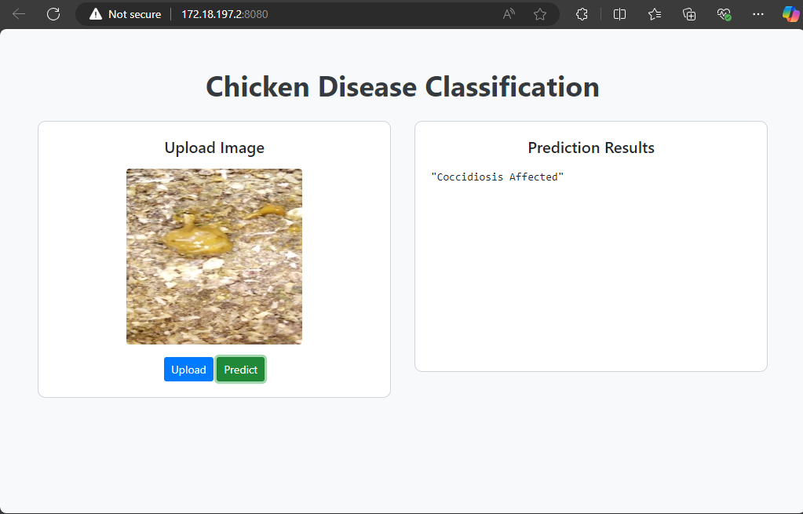

# MLOps-Production-Ready-Computer-Vision-Project: Chicken Disease Classification
[](https://github.com/ashaduzzaman-sarker/MLOps-Production-Ready-Computer-Vision-Project-Chicken-Disease-Classification/actions/workflows/main.yaml)

---

## Overview
This project is a production-ready MLOps pipeline for chicken disease classification using computer vision. It implements robust, modular, and scalable MLOps practices for a machine learning pipeline, from data ingestion to deployment.

### Key Features:
- **Modular Pipeline**: Includes stages for data ingestion, base model preparation, training, evaluation, and deployment.
- **DVC Integration**: Ensures reproducibility of experiments and tracks data and model artifacts.
- **CI/CD with GitHub Actions**: Automates testing and deployment.
- **Dockerized Deployment**: Uses Docker for containerized application deployment.
- **AWS Integration**: Supports deployment via AWS EC2 and ECR.



## Project Structure

```
├── .dvc/                       # DVC configuration files
├── .github/workflows/          # GitHub Actions workflows
├── src/cnnClassifier/          # Source code
│   ├── components/             # Core ML components
│   ├── config/                 # Configuration management
│   ├── constants/              # Global constants
│   ├── entity/                 # Data entities
│   ├── pipeline/               # Pipeline stages
│   ├── utils/                  # Utility functions
├── templates/                  # Web app templates
├── research/                   # Research notebooks
├── app.py                      # Flask application
├── Dockerfile                  # Docker configuration
├── dvc.yaml                    # DVC pipeline definition
├── requirements.txt            # Python dependencies
├── setup.py                    # Project setup script
├── params.yaml                 # Hyperparameters and configurations
├── README.md                   # Project README
```


## How to Run

### Prerequisites
1. Install [Conda](https://docs.conda.io/en/latest/).
2. Install [Docker](https://www.docker.com/).
3. Clone the repository:
   ```
   git clone https://github.com/ashaduzzaman-sarker/MLOps-Production-Ready-Computer-Vision-Project-Chicken-Disease-Classification.git
   cd MLOps-Production-Ready-Computer-Vision-Project-Chicken-Disease-Classification
   ```

### Steps

#### 1. Create a Conda Environment
```
conda create -n cnncls python=3.8 -y
conda activate cnncls
```

#### 2. Install Dependencies
```
pip install -r requirements.txt
```

#### 3. Run the Application
```
python app.py
```

#### 4. Open the Web Application
Visit `http://localhost:8080` in your browser.


## DVC Commands

1. Initialize DVC:
   ```
   dvc init
   ```

2. Reproduce Pipeline:
   ```
   dvc repro
   ```

3. Visualize Pipeline:
   ```
   dvc dag
   ```


## AWS CI/CD Deployment

### Deployment Steps:
1. **Login to AWS Console** and create an IAM user with the following policies:
   - `AmazonEC2ContainerRegistryFullAccess`
   - `AmazonEC2FullAccess`

2. **Create ECR Repository**:
   - Save the URI (e.g., `5*6***6**2.dkr.ecr.us-east-1.amazonaws.com/chicken`).

3. **Launch EC2 Instance**:
   - Install Docker:
     ```
     sudo apt-get update -y
     sudo apt-get upgrade -y
     curl -fsSL https://get.docker.com -o get-docker.sh
     sudo sh get-docker.sh
     sudo usermod -aG docker ubuntu
     newgrp docker
     ```

4. **Configure EC2 as Self-Hosted Runner**:
   - Go to GitHub → `Settings` → `Actions` → `Runners` → `New Self-Hosted Runner`.
   - Follow the instructions for setting up the runner.

5. **Set Up GitHub Secrets**:
   - Add the following secrets:
     ```
     AWS_ACCESS_KEY_ID=
     AWS_SECRET_ACCESS_KEY=
     AWS_REGION=us-east-1
     AWS_ECR_LOGIN_URI=566373416292.dkr.ecr.us-east-1.amazonaws.com
     ECR_REPOSITORY_NAME=chicken
     ```

## License
This project is licensed under the [MIT License](LICENSE).
